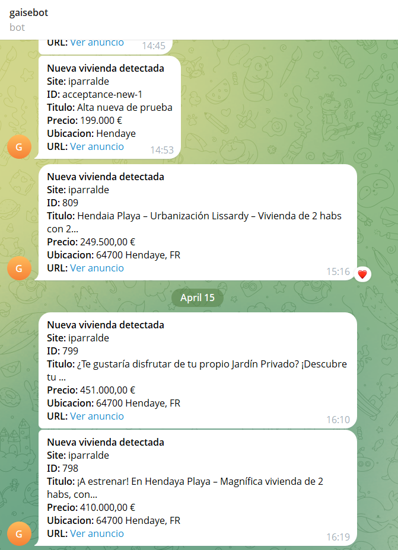
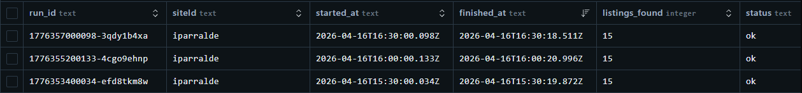
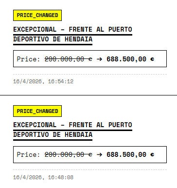
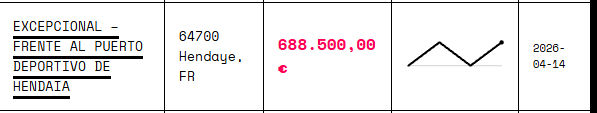
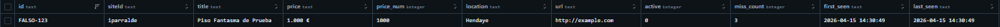
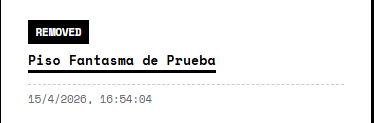
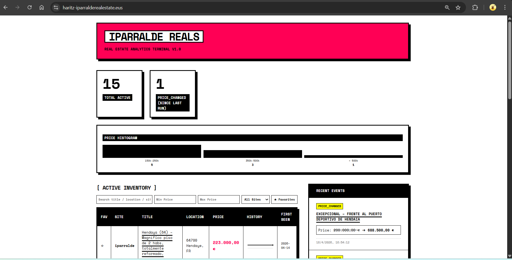
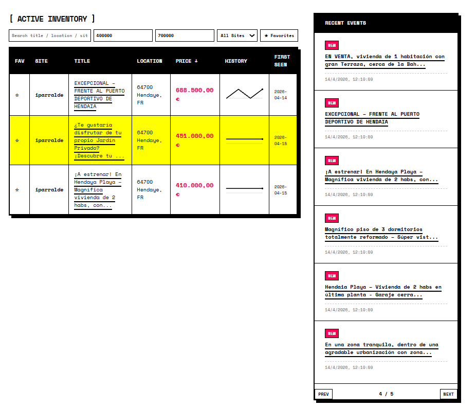
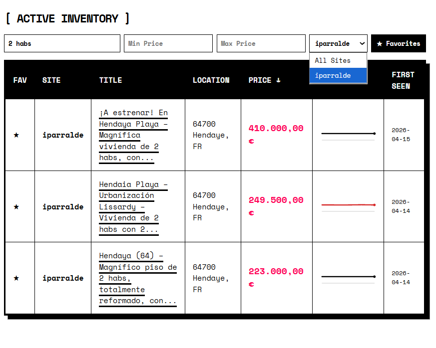

# Real Estate Scraper & Dashboard

> **Disclaimer:** Although all milestones are uploaded in their respective directories, the definitive code running on the Azure server is located exclusively in the `milestone6/` directory. The code from other directories might not contain all the correct and updated functionalities. 

- **Name:** Haritz Gomez Sarasola
- **What I did:** I developed an automated real estate scraper, structured a centralized Turso database, and created a frontend React dashboard to visualize property listings. The project extracts, processes, and displays real-time and historical property data. It also sends a Telegram notification using a bot when a change occurs.

## Milestones Completed
- I have successfully completed **all 10 milestones**, including the first three ones and:
  - **Milestone 4 (Optional):** Implemented Telegram notifications for new listings and price changes. You can see it working in the screenshot:

    

  - **Milestone 5:** Scraper automation using `node-cron`. It supports periodic execution via the `--schedule` flag and one-time execution with `--once` (ideal for Windows Task Scheduler which I used until deployment), though it currently runs autonomously on the server using `node-cron` every 30 minutes.

  The runs every 30 minutes can be seen in this screenshot:

  

  - **Milestone 6 Optional Enhancements:** Implemented advanced filtering (by text, site, min/max price), a Favorites/Watchlist feature (stored in localStorage), and a per-listing price history sparkline visualization on the frontend dashboard. I did not implement the web-socket functionality, so if a change occurs while being in the dashboard page it would require a page reload. The screenshots of the milestone are in the `screenshots/` directory.

  - Milestones 7, 8, 9 and 10 can be found in the [Deployment](#deployment-milestones-7-8-9-and-10) section below.

## Domain Name
The project is hosted and accessible at: **[https://haritz-iparralderealestate.eus](https://haritz-iparralderealestate.eus)**

## Adapters Implemented
As part of the multi-site scraping requirement in milestone 1, I implemented an adapter located at `milestone6/adapters/iparralde.js`. 

This adapter is responsible for the full data lifecycle of a listing from **Inmobiliaria Iparralde**:
- **Data Extraction:** Uses CSS selectors to isolate relevant fields like the property title, price, location, and the unique listing URL.
- **Normalization:** Cleans raw text (removing whitespace, currency symbols, and non-numeric characters) and converts prices into **cents** to ensure integer-based precision in the database.
- **Change Detection:** Extracts stable IDs from URLs or HTML attributes, allowing the system to compare the scraped data with the current database state to identify new listings or price variations.
- **Data Structuring:** Packages all information into a consistent JSON object that the scraper engine uses to update the unified Turso Database.

## Problems Encountered
- **Filter Accuracy:** I initially got 37 results instead of the expected 15 because the scraper was reading generic `.item` cards from multiple page sections (including side widgets/carousels) instead of only the main results list, and the search flow was not consistently tied to the exact filter form state. I fixed it by targeting the main listings container, applying strict form selections, and deduplicating by stable listing ID across internal pagination.
- **Currency Formatting:** In the dashboard filters, I dealt with cent/euro conversion mismatches between how the database stores the `price_num` (in cents to preserve precision without floats) and how the frontend dashboard filters and renders the price in Euros.
- **Data Consistency in Feed:** I noticed the "Recent Events" feed was showing empty price changes for new listings. This was because the scraper was saving a generic status change in JSON instead of the initial price. I refactored the database logic to store a cleaner `{old_price, new_price}` object so the UI can always show the "New Listing" price correctly.
- **Feed Pagination:** As the number of events grew, the dashboard became excessively long. I implemented client-side pagination for the events feed to keep the layout compact and professional without losing access to older history. For better performance the pagination should be implemented on the server rather than in the client, for now I implemented client-side pagination just for visual improvement.
- **Sparkline Rendering:** Encountered issues getting the SVG sparklines to accurately reflect price history trends, particularly adjusting visual logic to handle single-data-point flatlines and making minor price adjustments prominent enough to be visible on the SVG scale.

## Additional Comments
- **Frontend Design:** The dashboard's distinctive interface was developed using a frontend-skill available in [.github/skills/frontend-skill/SKILL.md](.github/skills/frontend-skill/SKILL.md). This approach focused on fast implementation and rapid design. 
The dashboard follows a **Brutalist Minimalist** aesthetic, characterized by high-contrast typography (Space Mono), bold borders, solid shadows, and a raw "terminal-like" structure that prioritizes data visibility over decorative elements. The dashboard can be improved to be more responsive so it can be accesed from a mobile phone in a comfortable way.

- **Testing Approach:** Since property listings in the target real estate sites do not change frequently, I validated the change detection and notification system through manual data manipulation in the Turso database. By manually modifying listing attributes (prices, active status) in the `listings_current` table, I was able to successfully trigger and verify the logic for price change alerts and property removal notifications. Some tests can be seen in this screenshot:

**Price change test**:

That change leads to this sparkline:

**Remove house test (A house is removed with MISS_COUNT=3)**:

## Screenshots
Here are some screenshots of the live dashboard in .eus:

Dashboard Overview:

*Caption: Overview of the Active Inventory, Price Histogram and Recent Events feed.*

Inventory and recent envents paginated:

*Caption: Inventory of houses and recent events paginated  (prices between 400.000 and 700.000).*

Filters (Milestone 6 enhancement):

*Caption: Filters by text in the title (2 habs) and only favorites visible (this is handled by localStorage).*

## Deployment (Milestones 7, 8, 9 and 10)

* **Infrastructure:** Hosted on a **Microsoft Azure Virtual Machine** (Ubuntu Linux 24.04 LTS).
* **Process Management (`systemd`):** Configured two background daemons managed by a dedicated `deploy` user to ensure services stay alive and restart on failure:
    * `real-estate-dashboard.service`: Manages the API and Frontend on port 3000.
    * `real-estate-scraper.service`: Manages the scraping engine.
* **Reverse Proxy:** **Nginx** handles incoming traffic on port 80/443 and securely proxies it to the internal Node.js application.
* **SSL/TLS Security:** Secured with **Certbot (Let's Encrypt)**, enforcing HTTPS.
* **Automation:** Periodic scraping is handled via `node-cron` integrated directly into the persistent scraper service.

## Lessons Learned & Difficulties

Building and deploying this full-stack application presented several real-world challenges and learning opportunities across the entire development lifecycle:

1. **Modern Scraping Techniques:** I learned how to move beyond simple HTML parsing by using browser automation and scraping agents (like Playwright). This was crucial for handling dynamic content, navigating complex DOM structures, and transforming messy web data into clean, structured objects.
2. **Database Agility with Turso:** I discovered how fast and developer-friendly Turso is for setting up a SQLite-compatible remote database. The SQL console in it is also really useful to make fast changes.
3. **Automation:** Implementing `node-cron` and using the Telegram bot taught to transition from manual scripts to having a fully autonomous background service that monitors properties 24/7.
4. **Port Management & Ghost Processes:** During deployment, I encountered errors where the dashboard wouldn't start because port 3000 was held by previous manual tests. I learned to use `fuser` and `ps` to identify and terminate blocking processes on the Linux VM.